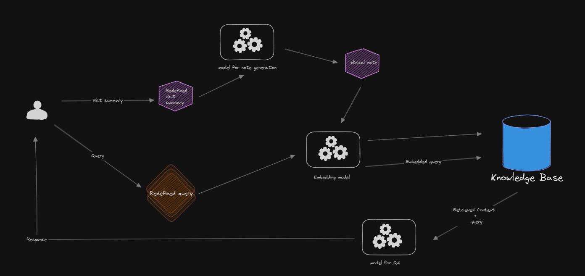

#  Introduction 

1. **<u>Project Background</u>** 
    In the healthcare industry, doctors often spend a significant amount of time reviewing a patient’s medical history and clinical notes to understand their current situation. This process can be time-consuming and inefficient, especially when doctors need to navigate through extensive records to find relevant information. Additionally, during patient encounters, doctors must manually document clinical notes, which adds to their workload and can lead to delays in patient care.  
    
2. **<u>Problem Statement</u>** 
    Doctors face several challenges in managing clinical documentation:

    - Time-Consuming Reviews: Doctors spend a significant amount of time reviewing past clinical notes to understand a patient’s medical history.

    - Manual Documentation: The process of manually writing clinical notes during or after patient encounters is tedious and prone to errors.

    - Inefficient Information Access: Finding specific information in a patient’s medical history can be difficult, especially when notes are unstructured or scattered across multiple records.

    These challenges lead to inefficiencies, increased workload, and potential delays in patient care. A solution is needed to automate clinical note generation and provide quick, accurate answers to doctors' queries about their patients. 

1. **<u>Planned Solution</u>** 
     Our solution to the problems described above is a web application that will allow doctors to:
    - **Input Key Points**: Doctors can easily input key points and information from patient encounters.

    - **Generate Clinical Notes**: The app will use a model to generate clinical notes following a defined process, ensuring accuracy and consistency.

    - **Answer Patient Queries**: The app will use the generated notes (stored as part of the RAG pipeline) to answer doctors' questions about their patients, providing quick and relevant information.  

2. **<u>Key User Level Requirements</u>** 
    The key user level requirements we obtained were: 
        ● Doctors should be able to input key points and information from patient encounters easily.

        ● The system should generate accurate and structured clinical notes using a suitable model.

        ● The app should use the generated notes to answer doctors' questions about their patients. 

        ● The app must ensure that all patient data is handled securely and in compliance with HIPAA regulations

3. **<u>Functional Requirements</u>** 
    We gathered our functional requirements based off of the key user level requirements 
    which are: 
        ● Input Handling: The system will accept key points and information from patient encounters.

        ● Note Generation: The system will use a fine-tuned model to generate clinical notes following a defined process to ensure accuracy.

        ● Query Answering: The app will retrieve relevant notes to answer doctors' questions about their patients.

        ● Review and Editing: Doctors will be able to review, edit, and finalize generated notes before saving them.

4. **<u>Non-Functional Requirements</u>** 
    Non-Functional requirements that should be noted while developing this web application 
    are: 
        ● Response Time: The system should generate clinical notes and answer queries within a reasonable period of time.

        ● Availability: The system must be operational 24/7 with minimal downtime.    

        ● Security: The system must comply with HIPAA (Health Insurance Portability and Accountability Act) regulations to ensure the privacy and security of patient data. This includes:

            Encrypting data both in transit and at rest.

            Implementing access controls to restrict unauthorized access to patient information.

            Maintaining audit logs to track access and modifications to patient data.

            Ensuring secure user authentication and authorization mechanisms.

        ● Accuracy: The generated notes and query responses must have a high degree of accuracy, with minimal need for manual corrections

# Technical approach :

1. Dataset Overview : 

    One of the key ways to shape our solution was to explore existing research on clinical note generation and medical question answering. Through this exploration, we identified publicly available datasets that provide valuable insights into best practices and real-world challenges. These datasets, containing annotated clinical encounter summaries and patient histories, enable us to benchmark model performance, address issues like unstructured inputs and complex queries, and overcome limitations. By leveraging these datasets, we ensure our solution aligns with proven methods and meets the needs of healthcare professionals.

    - [MTS-DIALOG](./mts_dialog_dataset.md)
    - [ACI-BENCH](./aci_bench_dataset.md)
    - [ASCLEPIUS-SYNTHETIC-CLINICAL-NOTES](./asclepius_dataset.md)

2. LLM Benchmarking : 
    Language models (LLMs) are essential for our solution, enabling accurate clinical note generation and reliable medical question answering. To ensure we select the most effective models, we conducted a benchmark focused on question-answering tasks. This process helps us identify LLMs that align with our needs and deliver a solution tailored to healthcare professionals.
    - [BENCHMARK_LINK](./benchmark.md)
  
3. Pipeline Design : 
