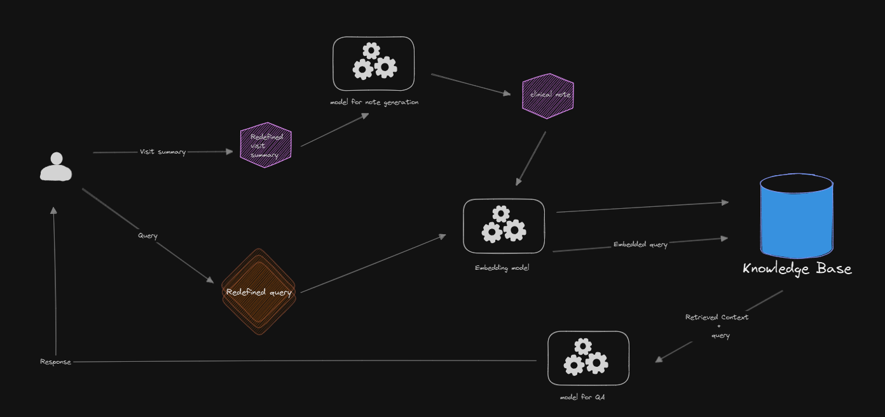

# WORKFLOW

## 1. Introduction
This workflow describes the process of automatically generating clinical notes and answering medical questions based on them using large language model (LLM).

## 2. Workflow Overview

## 3. Detailed Workflow Steps

- Step 1: **User Input**:
    doctor should capture the key points from the patient encounter either by entering bullet point
    or provide a voice record of the encounter wich it will be converted to a text

- Step 2: **data preprocessing**:
    in this step we need to prepare the data for the llm to generate clinical note:
        - voice-to-text-conversion
        - structuring(capture the bullet points to a suitable format) and text cleaning

- Step 3: **Clinical Note Generation**:
    after redefining the input of the user the llm need to generate the clinical note in a multi stage approach .This approach been demonstrated in the research paper (Generating medically-accurate summaries of patient-provider dialogue: Amulti-stage approach using large language models)[https://aclanthology.org/2023.clinicalnlp-1.26.pdf], it utilizes intermediate model calls to extract medical concepts that inform summarization generation :
    - extract the patient intent
    - extract the pertinent positive
    - extract the pertinent Unknowns
    - extract the pertinent Negatives
    - extract the medical history
    after these iterarive steps the llm combine the extracted information into a structred clinical note
  
    After generating the clinical note, the doctor can:

    - **Confirm the Credibility**: Verify that the note is accurate and complete.

    - **Modify the Note**: Make any necessary edits to ensure the note reflects the patient encounter accurately.

    - **Save to Knowledge Base**: Once confirmed or modified, the note is saved in the knowledge base for future reference and retrieval.

- Step 4: **Medical Question Answering**:
    this step help doctors to answer questions about their patient based on the stored clinical notes in the knowledge base ensuring HIPAA compliance and accurate responses
    - **Query cleaning**:
        Ensure the query is free of sensitive data and complies with HIPAA regulations by removing or anonymizing any Personally Identifiable Information (PII) or Protected Health Information (PHI).

    - **Query Embedding**:
        Convert the cleaned query into a numerical representation for semantic search

    - **Search the Knowledge Base**:
        Retrieve relevant clinical notes from the knowledge base that match the query

    - **Create a Valid Prompt Template:**:
        Combine the query and retrieved context into a structured prompt for the LLM to generate an accurate answer
 